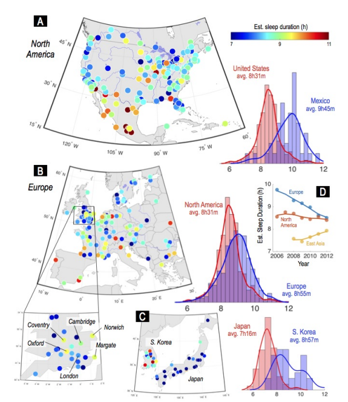
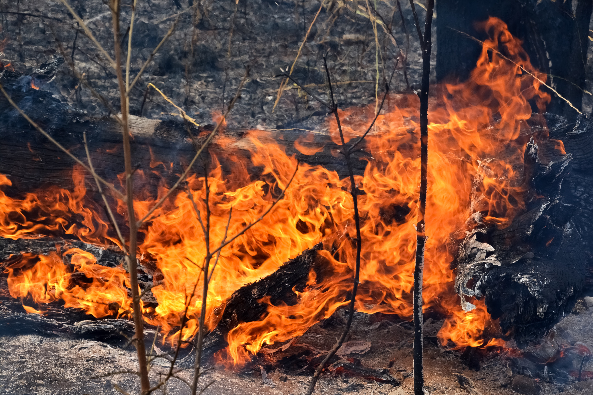
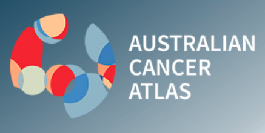
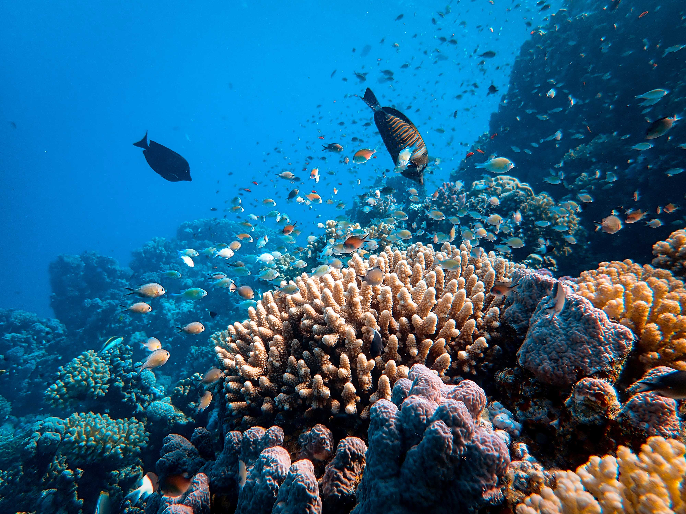
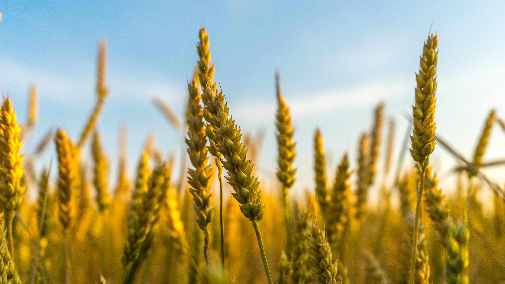
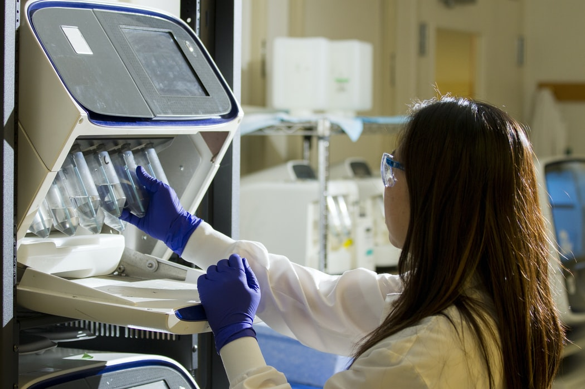

```{r, include = FALSE}
library(tidyverse)
library(rvest)
library(glue)
current_file <- knitr::current_input()
basename <- gsub(".Rmd$", "", current_file)
knitr::opts_chunk$set(
  fig.path = "images/",
  fig.width = 6,
  fig.height = 4,
  fig.align = "center",
  fig.retina = 3,
  echo = FALSE,
  results = "asis",
  warning = FALSE,
  dev.args = list(bg = "transparent"),
  message = FALSE,
  cache = FALSE,
  cache.path = "cache/",
  NULL
)
```


class: middle center hide-slide-number monash-bg-gray80


.info-box.w-50.bg-white[
These slides are viewed best by Chrome or Firefox and occasionally need to be refreshed if elements did not load properly. See <a href="`r rmarkdown::metadata$pdflink`">here for the PDF <i class="fas fa-file-pdf"></i></a>. 
]

<br>

.white[Press the **right arrow** to progress to the next slide!]


---

name: title
background-size: cover
class: title-slide
count: false

# .f-4.monash-blue[`r rmarkdown::metadata$title`]

<h2 style="font-weight:900!important;">`r rmarkdown::metadata$subtitle`</h2>

.bottom_abs.width100[

Presenter: *`r rmarkdown::metadata$author`*


<i class="fas fa-envelope"></i>  `r rmarkdown::metadata$email` <a href="https://twitter.com/statsgen" style="color:black"><i class="fab fa-twitter"></i> @statsgen</a>


<i class="fas fa-calendar-alt"></i> `r rmarkdown::metadata$date`

<br>

]

???

Hi everyone, I'm Emi Tanaka and I'm one of the faculty staff at the Department of Econometrics and Business Statistics. 


---

name: staffs


# Department of Econometrics and Business Statistics

```{r staff-list, cache = TRUE}
dat <- read_html("https://www.monash.edu/business/ebs/our-people/staff-directory") %>% 
  html_elements('[class="row"]') 

staffs <- dat %>% 
  map_dfr(~{
    name <- .x %>% 
      html_element(".staff-content") %>% 
      # two staff content for some reason!
      html_element(".staff-content") %>% 
      html_element("p") %>% 
      html_element("strong") %>% 
      html_text() %>% 
      str_replace_all("\\r\\n", "") %>% 
      str_squish()
    link <- .x %>% 
      html_element(".staff-content") %>% 
      # two staff content for some reason!
      html_element(".staff-content") %>% 
      html_element("p") %>% 
      html_element("a") %>% 
      html_attr("href")
    photo <- .x %>% 
      html_element(".col-sm-4-img") %>% 
      html_element("img") %>% 
      html_attr("src")
    position <- .x %>% 
      html_element(".staff-content") %>% 
      # two staff content for some reason!
      html_element(".staff-content") %>% 
      html_element("p") %>% 
      html_element("em") %>% 
      html_text()
    location <- .x %>% 
      html_element(".staff-content") %>% 
      # two staff content for some reason!
      html_element(".staff-content") %>% 
      html_element("p:nth-child(2)") %>% 
      html_element("span") %>% 
      html_text()
    keywords <- .x %>% 
      html_element(".col-sm-3") %>% 
      html_element("ul") %>% 
      html_elements("li") %>% 
      html_text()
    tibble(name, position, link, location, photo, keywords = list(keywords)) %>% 
      mutate(position = ifelse(name=="Benjamin Wong", "Senior Lecturer", position),
             status = case_when(str_detect(position, "(Adjunct|Emeritus)") ~ "Adjunct",
                                str_detect(position, "(EA|Admin|Manager)") ~ "Professional",
                                TRUE ~ "Academic"),
             location = case_when(name=="Rob Hyndman" ~ "Clayton",
                                  name=="Jiti Gao" ~ "Caulfield",
                                  name=="Tatsushi Oka" ~ "Caulfield",
                                  TRUE ~ location),
             photo = case_when(str_detect(photo, "Gael") ~ "images/photo-gael-martin.jpg",
                               TRUE ~ photo))
  })
  
academics <- staffs %>% 
  filter(status=="Academic")
  
```
```{r download-staff-photos, eval = FALSE}
# let's download the photo in case the site goes down on the day!!
walk2(staffs$photo, staffs$name, ~{
  if(!is.na(.x) && str_starts(.x, "https://")) {
    download.file(.x, 
                  destfile = glue("images/photo-{janitor::make_clean_names(.y)}.jpg"), 
                  quiet = TRUE, cacheOK = TRUE)
    
  } 
})
```


```{r update-staff-photos-to-local, include = FALSE}
staffs <- staffs %>% 
  rowwise() %>% 
  mutate(photo2 = glue("images/photo-{janitor::make_clean_names(name)}.jpg"),
         photo2 = ifelse(!str_starts(photo, "https://"), photo, photo2),
         photo2 = ifelse(str_detect(photo, "/[:alpha:][:alpha:].jpg$") , NA, photo2))
```

```{r staff-photo-mashup, cache = FALSE}
staffs %>% 
  filter(!is.na(photo2)) %>% 
  mutate(link = ifelse(is.na(link), "https://www.monash.edu/business/ebs", link)) %>% 
  select(photo = photo2, name, link) %>% 
  pwalk(function(photo, name, link) {
    print(glue("<div class='profile-photo'><a href='{link}'></a><span class='name-tag'>{name}</span></div>"))
  })
```

We have about `r scales::comma(nrow(academics), 5)` faculty staffs that work on **econometrics**, **business analytics** and **actuarial science**, on top of **statistics** and **data science**, for research and teaching.

```{r staff-counts, include = FALSE}
academics %>% 
  mutate(position = factor(position, levels = c("Assistant Lecturer",
                                                "Research Fellow",
                                                "Lecturer",
                                                "Senior Lecturer",
                                                "Associate Professor",
                                                "Professor"))) %>% 
  count(position, location) %>% 
  pivot_wider(position, names_from =  location, values_from = n, values_fill = 0)
```

???

Unlike other partner organisations that have been introduced in the Australian Data Science Network,  we are not a centre or lab but a department -- but quite a big department that consists of about 50 faculty members that work in econometrics, business analytics and acturial studies, and all this build on the foundation of statistics and data science. 

---

name: interests

# Key interest areas


```{r keywordcloud, cache = TRUE, fig.height = 7.5, fig.width = 16}
# [CHECK] make sure to check that the significant keywords show up
library(ggwordcloud)
keywords <- tibble(words = unlist(staffs$keywords)) %>% 
  # [TODO] need to clean some keywords
  filter(!words %in% c("Collaborative T&L methodology in large class settings"
                      )) %>% 
  mutate(words = tolower(words),
         words = str_replace(words, ",", ""),
         words = str_replace(words, "operations", "operational"),
         words = str_replace(words, "commentary:", ""),
         words = str_replace(words, "visualization", "visualisation"),
         words = str_replace(words, "time-series", "time series"),
         words = recode(words, 
                        `Operational Research` = "operations research",
                        `supervision: multivariate times series analysis` = "multivariate times series analysis")) %>%
  filter(!str_detect(words, "the role of learning spaces")) %>% 
  count(words)

set.seed(1)
ggplot(keywords, aes(label = words, size = n,
                     color = factor(sample.int(10, nrow(keywords), replace = TRUE)))) +
  geom_text_wordcloud(area_corr_power = 1)+
                      #, rm_outside = TRUE) + 
  scale_size_area(max_size = 14) + 
  theme_minimal() +
  scale_color_viridis_d(option = "mako")
```

???

This is a word cloud of the interests of our department staffs. We can see that our staffs have a large interest in econometrics, time series, forecasting, Bayesian methods, statistical computing


---

name: showcase

# World-leading Econometrics and Forecasting Unit

```{r fn-who, include = FALSE, cache = FALSE}
photos <- list.files("images/") %>% 
  str_subset("^photo")
who <- function(name, pos = '', monash = rep("m", length(name))) {
  pics <- map2_chr(name, monash, ~{
      apic <- str_subset(photos, .x)
      mon <- case_when(.y=="m" ~ "monash-person",
                       .y=="e" ~ "econ-person",
                       TRUE ~ "")
      glue("") %>% 
        as.character()
    }) %>% 
    paste(collapse = "")
  glue("<div class='img-bottom' style='{pos}'>{pics}</div>")
}
```

Selected projects and areas involving our department staffs

.flex[
<a href="https://www.monash.edu/business/ebs/research/showcase/covid19-research">
.box[
.box-up[

]
.box-bottom[
COVID-19
`r who(c("hyndman", "dianne", "inder", "jiti", "peng"))`
]]
</a>

<a href="https://www2.monash.edu/impact/articles/economy/how-a-tourism-slump-revolutionised-global-forecasting/">
.box[
.box-up[

]
.box-bottom[
Tourism
]
`r who(c("hyndman", "george"))`
]
</a>
<a href="https://www2.monash.edu/impact/articles/economics/how-to-boost-australian-jobs-construction-and-manufacturing/">
.box[
.box-up[

]
.box-bottom[
Employment
]
`r who(c("heather", "farshid", "benjamin"))`
]
</a>
<a href="https://www.monash.edu/business/ebs/research/showcase/towards-a-superannuation-system-fit-for-the-future">
.box[
.box-up[

]
.box-bottom[
Superannuation
]
`r who(c("bonsoo"))`
]
</a>
<a href="https://www.monash.edu/business/ebs/research/showcase/loss-based-bayesian-prediction">
.box[
.box-up[

]
.box-bottom[
Bayesian Prediction
]
`r who(c("martin", "hyndman", "frazier"))`
]
</a>
]
.flex[
.box[
.box-up[

]
.box-bottom[
Applied econometrics
]
`r who(c("brett", "natalia", "tatsushi", "xueyan", "peng", "benjamin", "klaus"))`
]
.box[
.box-up[

]
.box-bottom[
Econometrics education
]
`r who(c("roberts", "stapleton"))`
]

.box[
.box-up[

]
.box-bottom[
Financial econometrics
]
`r who(c("jiti", "brooks", "pantelous", "catherine", "bonsoo", "xibin", "wei"))`
]

.box[
.box-up[

]
.box-bottom[
Macroeconomics
]
`r who(c("heather", "benjamin", "ruben", "zhuo", "guido"))`
]
.box[
.box-up[

]
.box-bottom[
Micro-economics
]
`r who(c("xueyan", "duangkamon", "keith", "denni"))`
]
]


---

name: soda

# Spotlight 🔦 Sleeping pattern from internet usage

.flex[
.w-50[


]
.w-50[
`r who(c("klaus", "angus", "raschky"), pos = "visibility: visible;position:static;margin-right:200px;", monash = c("m", "e", "e"))` 

* Part of .bg-black.pa2.white[**SoDa Labs**]
* Social science insights from alternative data, e.g.
  * satellite imagery, 
  * digitised textual sources, 
  * internet activity and 
  * latency, search terms and trends, social media, news, and more.
]
]

.bottom_abs.f4[
Ackermann, Angus & Raschky (2017) The Internet as Quantitative Social Science Platform: Insights
From a Trillion Observations
]

---

class: newspaper
name: economics

# Spotlight 🔦 Policy and health economics


.flex[
.w-33.br.pa3[
## Alcohol taxation 

"Equal Tax for Equal Alcohol? Beverage Types and Antisocial and Unlawful Behaviours" 


## Government Environmental stringency policies and productivity in OECD countries


]
.w-33.br.pa3[
## Prescription drug use and mental health

"New research provides a more detailed picture of why Australians are increasingly abusing pharmaceutical drugs."

## Mental health length of stay and psychiatric readmission

]
.w-33.pa3[
## Private vs Public hospital length of stay for hip replacement

[Short outcome?]

## Bushfires, pollution and hospital respiratory admission

]
]


---

name: analytics

# Key insights from domain data analytics 

.container[
<figure>

<figcaption>Bush fire</figcaption>
`r who(c("dianne", "xueyan"))`
</figure>
<figure>

`r who(c("dianne"))`
<figcaption></figcaption>
</figure>
<figure>

<figcaption>Physics</figcaption>
`r who(c("dianne"))`
</figure>
<figure>

<figcaption>Environment & Ecology</figcaption>
`r who(c("patricia"))`
</figure>
<figure>

<figcaption>Agriculture</figcaption>
`r who(c("tanaka", "patricia", "dianne"))`
</figure>
<figure>

<figcaption>Human data</figcaption>
`r who(c("lauren"))`
</figure>
<figure>

<figcaption>Bioinformatics</figcaption>
`r who(c("dianne", "tanaka", "stuart"))`
</figure>
<figure>

<figcaption>Election</figcaption>
`r who(c("dianne", "hyndman"))`
</figure>
<figure>

<figcaption>Actuary</figcaption>
`r who(c("hamza", "julie", "athanasios", "dan_zhu", "matthews", "nikpour"))`
</figure>
<figure>

<figcaption>Water quality</figcaption>
`r who(c("hyndman", "wild"))`
</figure>
<figure>

<figcaption>Energy usage</figcaption>
`r who(c("george", "hyndman"))`
</figure>
<figure>

<figcaption>Census</figcaption>
`r who(c("hyndman", "dianne"))`
</figure>
]


---

name: software

# Software Development

Selected R-packages (and Stan) developed by our department staffs and students

```{r hex, cache = FALSE}
logos <- list.files("images/") %>% 
  str_subset("^logo")

print_logo <- function(x, who = NULL, pos = '', 
                       monash =  paste(rep("m", length(who)), collapse = "")) {
  monash <- str_split(monash, "")[[1]]
  alogo <- str_subset(logos, paste0(x, "$"))
  if(is.null(who)) {
    res <- glue("")
  } else {
    devs <- who(who, pos, monash = monash)
    res <- glue("<div class='logo-container'>{devs}</div>")
  }
  res
}

walk(str_extract(sample(logos), "[a-z]+.png"), ~print(print_logo(.x)))
```

.fr[
.monash-bg-blue.pa2.white.ba[
Non-Uniform Monash Business Analytics Team (**NUMBAT**)

]

]

---

name: tools4humans

# Spotlight 🔦 Tools with human-centered designs

.animate__animated.animate__slideInRight[

## Tidy time series analysis and forecasting

.flex[
`r print_logo("tsibble.png", who = c("earo_wang", "dianne", "hyndman", "wild"), pos = 'top:150%;')` &nbsp; `r print_logo("tsibbledata.png", who = c("wild", "hyndman", "earo"), pos = 'top:150%;')` &nbsp; `r print_logo("feasts.png", who = c("wild", "hyndman", "earo"), pos = 'top:150%;')` &nbsp; `r print_logo("fable.png", who = c("wild", "hyndman", "earo"), pos = 'top:150%;')` &nbsp; `r print_logo("fasster.png", who = c("wild", "hyndman"), pos = 'top:150%;')` &nbsp; `r print_logo("sugrrants.png", who = c("earo_wang", "dianne", "hyndman"), pos = 'top:150%;')` &nbsp; `r print_logo("gravitas.png", who = c("gupta", "hyndman", "dianne", "unwin"), pos = 'top:150%;', monash = c("mmmx"))`

]

]
<br><br>

.animate__animated.animate__slideInLeft[
.fr[

## Grammar of experimental designs
.fr.flex[
`r print_logo("edibble.png", who = c("tanaka"), pos = 'right:100%;top:200%;')`  &nbsp; `r print_logo("deggust.png", who = c("tanaka"), pos = 'right:100%;top:200%;')`

]]]

---

name: data-vis

# Spotlight 🔦 Data visualisation 

## Visual inference

`r print_logo("nullabor.png", who = c("dianne", "wickham", "chowdhury", "hofmann"), monash = "mxxx")`

.fr[
## Spatial visualisation


`r print_logo("sugarbag.png", who = c("kobakian", "dianne"), pos = '')`


]

<br>

## High-dimensional data visualisation

.flex[
`r print_logo("tourr.png", who = c("dianne", "wickham"), pos = '', monash = 'mx')` &nbsp;  `r print_logo("spinifex.png", who = c("spyrison", "dianne"), pos = '')` &nbsp;  `r print_logo("ferrn.png",  who = c("sherry", "dianne", "ursula", "nicolas", "patricia"), pos = '', monash = 'mmxxm')` 
]


---

name: contact


# Department of Econometrics and Business Statistics


<i class="fas fa-link"></i> https://www.monash.edu/business/ebs

<i class="fab fa-twitter"></i> [@MonashEBS](https://twitter.com/monashebs)

<div class="w-45 f3" style='position:absolute;right:30px;top:160px;padding:30px;border:1px solid black;padding:10px;'>
Theoretical foundations & methodology in statistics and econometrics, mixed with development of computational tools and translational research 
</div>

<br>

.fr.bg-black.white.pa2[
## SoDa Labs: social science insights from alternative data
]
.fr[
<i class="fas fa-link"></i>    https://www.monash.edu/business/soda-labs/home

<i class="fab fa-twitter"></i> [@TheRealSodaLabs](https://twitter.com/TheRealSodaLabs)
]


<br><br><br>

## .monash-bg-blue.white.pl2.pr2.pt2.pb1[Non-Uniform Monash &nbsp;  &nbsp;Business Analytics Team (NUMBAT)]

<i class="fas fa-link"></i>  https://numbat.space/

<i class="fab fa-twitter"></i>  [@numbats_rise_up](https://twitter.com/numbats_rise_up)


