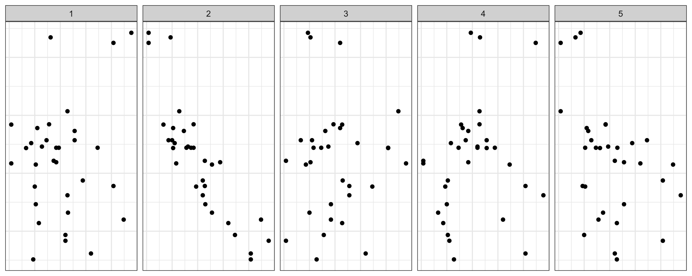

```{r, include = FALSE}
library(tidyverse)
library(rvest)
library(glue)
current_file <- knitr::current_input()
basename <- gsub(".Rmd$", "", current_file)
knitr::opts_chunk$set(
  fig.path = "images/",
  fig.width = 6,
  fig.height = 4,
  fig.align = "center",
  fig.retina = 3,
  echo = FALSE,
  results = "asis",
  warning = FALSE,
  dev.args = list(bg = "transparent"),
  message = FALSE,
  cache = TRUE,
  cache.path = "cache/",
  NULL
)
```


class: middle center hide-slide-number monash-bg-gray80


.info-box.w-50.bg-white[
These slides are viewed best by Chrome or Firefox and occasionally need to be refreshed if elements did not load properly. See <a href="`r rmarkdown::metadata$pdflink`">here for the PDF <i class="fas fa-file-pdf"></i></a>. 
]

<br>

.white[Press the **right arrow** to progress to the next slide!]


---

name: title
background-size: cover
class: title-slide
count: false

# .f-4.monash-blue[`r rmarkdown::metadata$title`]

<h2 style="font-weight:900!important;">`r rmarkdown::metadata$subtitle`</h2>

.bottom_abs.width100[

Presenter: *`r rmarkdown::metadata$author`*


<i class="fas fa-envelope"></i>  `r rmarkdown::metadata$email` <a href="https://twitter.com/statsgen" style="color:black"><i class="fab fa-twitter"></i> @statsgen</a>


<i class="fas fa-calendar-alt"></i> `r rmarkdown::metadata$date`

<br>

]

???

Hi everyone, I'm Emi Tanaka and I'm one of the faculty members at the Department of Econometrics and Business Statistics and today I'm going to introduce my department along with some spotlights on the work of our department members. 


---

name: staffs


# Department of Econometrics and Business Statistics

```{r staff-list, cache = TRUE}
dat <- read_html("https://www.monash.edu/business/ebs/our-people/staff-directory") %>% 
  html_elements('[class="row"]') 

staffs <- dat %>% 
  map_dfr(~{
    name <- .x %>% 
      html_element(".staff-content") %>% 
      # two staff content for some reason!
      html_element(".staff-content") %>% 
      html_element("p") %>% 
      html_element("strong") %>% 
      html_text() %>% 
      str_replace_all("\\r\\n", "") %>% 
      str_squish()
    link <- .x %>% 
      html_element(".staff-content") %>% 
      # two staff content for some reason!
      html_element(".staff-content") %>% 
      html_element("p") %>% 
      html_element("a") %>% 
      html_attr("href")
    photo <- .x %>% 
      html_element(".col-sm-4-img") %>% 
      html_element("img") %>% 
      html_attr("src")
    position <- .x %>% 
      html_element(".staff-content") %>% 
      # two staff content for some reason!
      html_element(".staff-content") %>% 
      html_element("p") %>% 
      html_element("em") %>% 
      html_text()
    location <- .x %>% 
      html_element(".staff-content") %>% 
      # two staff content for some reason!
      html_element(".staff-content") %>% 
      html_element("p:nth-child(2)") %>% 
      html_element("span") %>% 
      html_text()
    keywords <- .x %>% 
      html_element(".col-sm-3") %>% 
      html_element("ul") %>% 
      html_elements("li") %>% 
      html_text()
    tibble(name, position, link, location, photo, keywords = list(keywords)) %>% 
      mutate(position = ifelse(name=="Benjamin Wong", "Senior Lecturer", position),
             status = case_when(str_detect(position, "(Adjunct|Emeritus)") ~ "Adjunct",
                                str_detect(position, "(EA|Admin|Manager)") ~ "Professional",
                                TRUE ~ "Academic"),
             location = case_when(name=="Rob Hyndman" ~ "Clayton",
                                  name=="Jiti Gao" ~ "Caulfield",
                                  name=="Tatsushi Oka" ~ "Caulfield",
                                  TRUE ~ location),
             photo = case_when(str_detect(photo, "Gael") ~ "images/photo-gael-martin.jpg",
                               TRUE ~ photo))
  })
  
academics <- staffs %>% 
  filter(status=="Academic")
  
```
```{r download-staff-photos, eval = FALSE}
# let's download the photo in case the site goes down on the day!!
walk2(staffs$photo, staffs$name, ~{
  if(!is.na(.x) && str_starts(.x, "https://")) {
    download.file(.x, 
                  destfile = glue("images/photo-{janitor::make_clean_names(.y)}.jpg"), 
                  quiet = TRUE, cacheOK = TRUE)
    
  } 
})
```


```{r update-staff-photos-to-local, include = FALSE}
staffs <- staffs %>% 
  rowwise() %>% 
  mutate(photo2 = glue("images/photo-{janitor::make_clean_names(name)}.jpg"),
         photo2 = ifelse(!str_starts(photo, "https://"), photo, photo2),
         photo2 = ifelse(str_detect(photo, "/[:alpha:][:alpha:].jpg$") , NA, photo2))
```

```{r staff-photo-mashup, cache = TRUE}
staffs %>% 
  filter(!is.na(photo2)) %>% 
  mutate(link = ifelse(is.na(link), "https://www.monash.edu/business/ebs", link)) %>% 
  select(photo = photo2, name, link) %>% 
  pwalk(function(photo, name, link) {
    print(glue("<div class='profile-photo'><a href='{link}'></a><span class='name-tag'>{name}</span></div>"))
  })
```

We have about `r scales::comma(nrow(academics), 5)` faculty staff who work on **econometrics**, **business analytics** and **actuarial science**, on top of **statistics** and **data science**, for research and teaching.

```{r staff-counts, include = FALSE}
academics %>% 
  mutate(position = factor(position, levels = c("Assistant Lecturer",
                                                "Research Fellow",
                                                "Lecturer",
                                                "Senior Lecturer",
                                                "Associate Professor",
                                                "Professor"))) %>% 
  count(position, location) %>% 
  pivot_wider(position, names_from =  location, values_from = n, values_fill = 0)
```

???

Unlike other partner organisations that have been introduced in the Australian Data Science Network,  we are not a centre or lab but a department -- but quite a big department that consists of about 50 faculty members that work in econometrics, business analytics and acturial studies, and all this build on the foundation of statistics and data science. 

A number of our department staffs are recognised as most distinguished individuals in their discipline. For example, 

* our head of department, Rob Hyndman has been recently elected to Australian Academy of Science
* a number of staffs are fellows of Academy of Social Sciences in Australia (Heather, Jiti, Rob, Max King, Gael, Keith McLaren, Alan Powell, Farshid)
* Fellow of American Statistical Association: Di
* Fellow of International Association for Applied Econometrics: Farshid and Heather 
* Fellow of Journal of Econometrics: Jiti

---

name: interests

# Key interest areas


```{r keywordcloud, cache = TRUE, fig.height = 7.5, fig.width = 16}
# [CHECK] make sure to check that the significant keywords show up
library(ggwordcloud)
keywords <- tibble(words = unlist(staffs$keywords)) %>% 
  # [TODO] need to clean some keywords
  filter(!words %in% c("Collaborative T&L methodology in large class settings"
                      )) %>% 
  mutate(words = tolower(words),
         words = str_replace(words, ",", ""),
         words = str_replace(words, "operations", "operational"),
         words = str_replace(words, "commentary:", ""),
         words = str_replace(words, "visualization", "visualisation"),
         words = str_replace(words, "time-series", "time series"),
         words = recode(words, 
                        `Operational Research` = "operations research",
                        `supervision: multivariate times series analysis` = "multivariate times series analysis")) %>%
  filter(!str_detect(words, "the role of learning spaces")) %>% 
  count(words)

set.seed(1)
ggplot(keywords, aes(label = words, size = n,
                     color = factor(sample.int(10, nrow(keywords), replace = TRUE)))) +
  geom_text_wordcloud(area_corr_power = 1)+
                      #, rm_outside = TRUE) + 
  scale_size_area(max_size = 14) + 
  theme_minimal() +
  scale_color_viridis_d(option = "mako")
```

???

This is a word cloud of the interests of our department staffs. We can see that our staffs have a large interest in econometrics, time series, forecasting, Bayesian methods, statistical computing. There are some unusal interest areas to business statistics, like plant breeding and quantiative genetics, but underlying statistics that everyone of our staffs use can be applicable broadly to many quantitative areas.


---

name: showcase

# World-leading Econometrics and Forecasting Unit

```{r fn-who, include = FALSE, cache = TRUE}
photos <- list.files("images/") %>% 
  str_subset("^photo")
who <- function(name, pos = '', monash = rep("m", length(name))) {
  pics <- map2_chr(name, monash, ~{
      apic <- str_subset(photos, .x)
      mon <- case_when(.y=="m" ~ "monash-person",
                       .y=="e" ~ "econ-person",
                       TRUE ~ "")
      glue("") %>% 
        as.character()
    }) %>% 
    paste(collapse = "")
  glue("<div class='img-bottom' style='{pos}'>{pics}</div>")
}
```

Selected projects and areas involving our department staffs

.flex[
<a href="https://www.monash.edu/business/ebs/research/showcase/covid19-research">
.box[
.box-up[

]
.box-bottom[
COVID-19
`r who(c("hyndman", "dianne", "inder", "jiti", "peng"))`
]]
</a>

<a href="https://www2.monash.edu/impact/articles/economy/how-a-tourism-slump-revolutionised-global-forecasting/">
.box[
.box-up[

]
.box-bottom[
Tourism
]
`r who(c("hyndman", "george"))`
]
</a>
<a href="https://www2.monash.edu/impact/articles/economics/how-to-boost-australian-jobs-construction-and-manufacturing/">
.box[
.box-up[

]
.box-bottom[
Employment
]
`r who(c("heather", "farshid", "benjamin"))`
]
</a>
<a href="https://www.monash.edu/business/ebs/research/showcase/towards-a-superannuation-system-fit-for-the-future">
.box[
.box-up[

]
.box-bottom[
Superannuation
]
`r who(c("bonsoo"))`
]
</a>
<a href="https://www.monash.edu/business/ebs/research/showcase/loss-based-bayesian-prediction">
.box[
.box-up[

]
.box-bottom[
Bayesian Prediction
]
`r who(c("martin", "hyndman", "frazier", "zhuo", "luis"))`
]
</a>
]
.flex[
.box[
.box-up[

]
.box-bottom[
Applied econometrics
]
`r who(c("brett", "natalia", "tatsushi", "xueyan", "peng", "benjamin", "klaus"))`
]
.box[
.box-up[

]
.box-bottom[
Econometrics education
]
`r who(c("roberts", "stapleton"))`
]

.box[
.box-up[

]
.box-bottom[
Financial econometrics
]
`r who(c("jiti", "brooks", "pantelous", "catherine", "bonsoo", "xibin", "wei"))`
]

.box[
.box-up[

]
.box-bottom[
Macroeconomics
]
`r who(c("heather", "benjamin", "ruben", "zhuo", "guido"))`
]
.box[
.box-up[

]
.box-bottom[
Micro-economics
]
`r who(c("xueyan", "duangkamon", "keith", "denni"))`
]
]


???

On the top are some specific projects that our department staffs have worked on. On the bottom are some areas in econometrics.

Note: hover over the projects/areas to see who are involved.


---

name: soda

# Spotlight 🔦 Sleeping pattern from internet usage

.flex[
.w-50[


]
.w-50[
`r who(c("klaus", "angus", "raschky"), pos = "visibility: visible;position:static;margin-right:200px;", monash = c("m", "e", "e"))` 

* Part of .bg-black.pa2.white[**SoDa Labs**]
* Social science insights from alternative data, e.g.
  * satellite imagery, 
  * digitised textual sources, 
  * internet activity and 
  * latency, search terms and trends, social media, news, and more.
]
]

.bottom_abs.f4[
Ackermann, Angus & Raschky (2017) The Internet as Quantitative Social Science Platform: Insights
From a Trillion Observations
]

???

Some of our staffs are involved in big data and machine learning. Here we have a spotlight on Klaus who is a founding member of the SoDa labs. Soda labs is a joint venture between some staffs in our deparment and department of economics at Monash and they get social science insights from alternative data, like satelite imagery, text, internet activity and so on.

---

class: newspaper
name: economics

# Spotlight 🔦 Policy and health economics


.flex[
.w-33.br.pa1[
## Equal tax for equal alcohol?

.headline[
by Xueyan Zhao
]
Study of beverage types and antisocial and unlawful behaviours reveals cask wine appears to be significantly under-taxed despite its external costs to the society. 


## Effects of environmental policies and productivity 

.headline[
by Xueyan Zhao
]
The OECD environment and production data shows more strict policy in fact in the long run increase productivity.

]
.w-33.br.pa1[
## Prescription drug use and mental health

.headline[
by Xueyan Zhao
]


Mental health problems are driving Australia’s increasing misuse of pharmaceutical drugs including painkillers, tranquillizers and steroids, new research has found.


<br>

## Mental health: length of stay and psychiatric re-admission

.headline[
by Yan Meng and Xueyan Zhao
]

]
.w-33.pa1[
## Private vs public hospital length of stay for hip replacement

.headline[
by Yan Meng, Xueyan Zhao, Xibin Zhang and Jiti Gao
]

Study suggests shorter stay in public hospitals due to pressure from activity-based funding scheme, and longer stay in private system due to potential moral hazard. 

## Bushfires, pollution and hospital respiratory admission

.headline[
by Callum Shaw, Xueyan Zhao and Dianne Cook
]

]
]

???

A number of staffs study the effects of policy. Here we have a spotlight on Xueyan who works on a large number of health, government and survey data to study policy and health economics. 

---

name: analytics

# Key insights from domain data analytics 

.container[
<figure>

<figcaption>Bush fire</figcaption>
`r who(c("dianne", "xueyan"))`
</figure>
<figure>

`r who(c("dianne"))`
<figcaption></figcaption>
</figure>
<figure>

<figcaption>Physics</figcaption>
`r who(c("dianne"))`
</figure>
<figure>

<figcaption>Environment & Ecology</figcaption>
`r who(c("patricia"))`
</figure>
<figure>

<figcaption>Agriculture</figcaption>
`r who(c("tanaka", "patricia", "dianne"))`
</figure>
<figure>

<figcaption>Human data</figcaption>
`r who(c("lauren"))`
</figure>
<figure>

<figcaption>Bioinformatics</figcaption>
`r who(c("dianne", "tanaka", "stuart"))`
</figure>
<figure>

<figcaption>Election</figcaption>
`r who(c("dianne", "hyndman"))`
</figure>
<figure>

<figcaption>Actuary</figcaption>
`r who(c("hamza", "julie", "athanasios", "dan_zhu", "matthews", "nikpour"))`
</figure>
<figure>

<figcaption>Water quality</figcaption>
`r who(c("hyndman", "puwasala"))`
</figure>
<figure>

<figcaption>Energy usage</figcaption>
`r who(c("george", "hyndman"))`
</figure>
<figure>

<figcaption>Census</figcaption>
`r who(c("hyndman", "dianne"))`
</figure>
]


???

A number of our staffs also work in areas outside of economics. 


---

name: software

# Software Development

Selected R-packages (and Stan) developed by our department staffs and students

```{r hex, cache = TRUE}
logos <- list.files("images/") %>% 
  str_subset("^logo")

print_logo <- function(x, who = NULL, pos = '', 
                       monash =  paste(rep("m", length(who)), collapse = "")) {
  monash <- str_split(monash, "")[[1]]
  alogo <- str_subset(logos, paste0(x, "$"))
  if(is.null(who)) {
    res <- glue("")
  } else {
    devs <- who(who, pos, monash = monash)
    res <- glue("<div class='logo-container'>{devs}</div>")
  }
  res
}

walk(str_extract(sample(logos), "[a-z]+.png"), ~print(print_logo(.x)))
```

.fr[
.monash-bg-blue.pa2.white.ba[
Non-Uniform Monash Business Analytics Team (**NUMBAT**)

]

]

???

Besides the foundational and theoretical work, many members of the business analytics group, called the non-uniform monash business analytics team, or simply NUMBAT, translate methodology into useful tools.

---

name: tools4humans

# Spotlight 🔦 Tools with human-centered designs

<br>


.animate__animated.animate__slideInRight[

## Tidy time series analysis and forecasting

.flex[
`r print_logo("tsibble.png", who = c("earo_wang", "dianne", "hyndman", "wild"), pos = 'top:150%;')` &nbsp; `r print_logo("tsibbledata.png", who = c("wild", "hyndman", "earo"), pos = 'top:150%;')` &nbsp; `r print_logo("feasts.png", who = c("wild", "hyndman", "earo"), pos = 'top:150%;')` &nbsp; `r print_logo("fable.png", who = c("wild", "hyndman", "earo"), pos = 'top:150%;')` &nbsp; `r print_logo("fasster.png", who = c("wild", "hyndman"), pos = 'top:150%;')` &nbsp; `r print_logo("sugrrants.png", who = c("earo_wang", "dianne", "hyndman"), pos = 'top:150%;')` &nbsp; `r print_logo("gravitas.png", who = c("gupta", "hyndman", "dianne", "unwin"), pos = 'top:150%;', monash = c("mmmx"))`

]

]
<br><br>

.animate__animated.animate__slideInLeft[
.fr[

## Grammar of experimental designs
.fr.flex[
`r print_logo("edibble.png", who = c("tanaka"), pos = 'right:100%;top:200%;')`  &nbsp; `r print_logo("deggust.png", who = c("tanaka"), pos = 'right:100%;top:200%;')`

]]]

???

Some of the tool development focus on the human user aspect and make it easier to guide novice in their thinking by code.

---

name: data-vis
class: bg-newspaper

# .black[Spotlight 🔦 Data visualisation]

.center.w-30.bg-white.h-35.ba.showcase-container.animate__fadeIn.animate__animated[
## Visual inference

`r print_logo("nullabor.png", who = c("dianne", "wickham", "chowdhury", "hofmann"), monash = "mxxx")`

```{r nullabor-showcase, fig.width = 10, results='hold', fig.show='hide'}
library(nullabor)
d <- lineup(null_permute("mpg"), mtcars, n = 5, pos = 2)
ggplot(data=d, aes(x=mpg, y=wt)) + geom_point() + facet_wrap(~ .sample, nrow = 1) +
  theme_bw() + theme(axis.text = element_blank(),
                     axis.title = element_blank(),
                     axis.ticks.length = unit(0, "mm"),
                     plot.background = element_rect(fill = "transparent"))
```


]

<br>

.fr.center.w-30.bg-white.h-35.ba.showcase-container.animate__fadeIn.animate__animated.animate__delay-2s[
## Spatial visualisation


`r print_logo("sugarbag.png", who = c("kobakian", "dianne"), pos = '')`


]
.center.w-50.bg-white.h-35.ba.ml4.showcase-container.animate__fadeIn.animate__animated.animate__delay-1s[

## High-dimensional data visualisation

.flex[
`r print_logo("tourr.png", who = c("dianne", "wickham"), pos = '', monash = 'mx')` &nbsp;  `r print_logo("spinifex.png", who = c("spyrison", "dianne"), pos = '')` &nbsp;  `r print_logo("ferrn.png",  who = c("sherry", "dianne", "ursula", "nicolas", "patricia"), pos = '', monash = 'mmxxm')` 
]


]

???

We also have a number of research into data visualisation and here are some tools developed in this area with our department staff involvement. 

---

name: contact


# Department of Econometrics and Business Statistics


<i class="fas fa-link"></i> https://www.monash.edu/business/ebs

<i class="fab fa-twitter"></i> [@MonashEBS](https://twitter.com/monashebs)

<div class="w-45 f3" style='position:absolute;right:30px;top:160px;padding:30px;border:1px solid black;padding:10px;'>
Theoretical foundations & methodology in statistics and econometrics, combined with the development of computational tools and translational research 
</div>

<br>

.fr.bg-black.white.pa2[
## SoDa Labs: social science insights from alternative data
]
.fr[
<i class="fas fa-link"></i>    https://www.monash.edu/business/soda-labs/home

<i class="fab fa-twitter"></i> [@TheRealSodaLabs](https://twitter.com/TheRealSodaLabs)
]


<br><br><br>

## .monash-bg-blue.white.pl2.pr2.pt2.pb1[Non-Uniform Monash &nbsp;  &nbsp;Business Analytics Team (NUMBAT)]

<i class="fas fa-link"></i>  https://numbat.space/

<i class="fab fa-twitter"></i>  [@numbats_rise_up](https://twitter.com/numbats_rise_up)

.absolute.right-1.bottom-1[
&nbsp;&nbsp;&nbsp;&nbsp;<i class="fas fa-caret-right"></i> Slides at http://emitanaka.org/slides-ADSN

<i class="fas fa-code"></i> https://github.com/emitanaka/slides-ADSN
]

???

Our department is quite diverse where we have people working on theory & methods, but also people develope computational tools and translational research. 

You can find out more details about each staff including their contact details at these links. 

You can follow some department activites by following our twitter accounts.